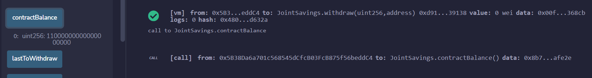

# CFB_Mod20_Challenge: Joint Savings Smart Contract
This exercise creates a Solidity-based smart contract that allows two customers to both send or receive funds to/from a joint savings account.  The application was coded in Remix.

---

## Technologies

The application is written in Solidity version 5.0 through the use of Remix IDE:  

*[Remix] - browser-based compiler and IDE for Solidity based smart contracts

*[Ganache] - https://trufflesuite.com

## Installation Guide

Remix IDE can be utilized on the web so no packages need to be installed. The website is **https://remix.ethereum.org**

## Usage and Content

To use the application, pls clone the repository, access Remix, and run **joint_savings.sol**.  

Here are some images that illustrate the test transactions that were run:

Set Accounts:

Deposit 1:

Deposit 2:

Deposit 3:

Withdrawal 1:

Withdrawal 1 Last to Withdraw:

Withdrawal 2:

Withdrawal 2 Last to Withdraw:

## Contributors
Vishnu Kurella, vishnu.kurella@gmail.com

## License
VK.LQA 2021

